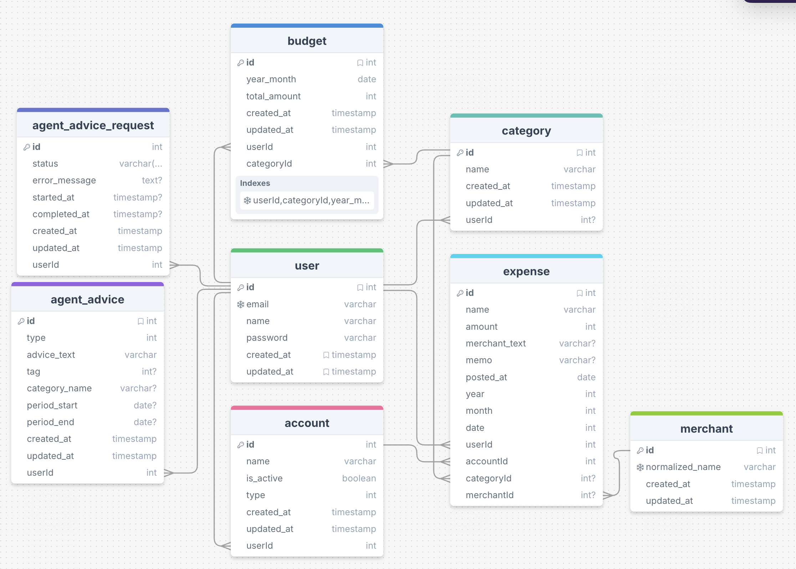

# Financial Management Backend

> 개인 지출 관리를 제공하는 GraphQL API 서버

사용자의 지출과 예산을 관리하는 백엔드 애플리케이션입니다.
클린 아키텍처 원칙을 적용하여 설계되었습니다.

<sub>관련 프로젝트</sub>
</br>
<sub>🤖 AI 조언 생성 서비스 (LLM Orchestration): https://github.com/chanhong-ji/coach-agent</sub>
</br>
<sub>🖥 프론트엔드: https://github.com/chanhong-ji/coach-frontent</sub>

---

## 📑 목차

- [주요 기능](#-주요-기능)
- [기술 스택](#-기술-스택)
- [아키텍처](#-아키텍처)
- [프로젝트 구조](#-프로젝트-구조)
- [데이터베이스 설계](#-데이터베이스-설계)
- [AI 조언 기능](#-ai-조언-기능)
- [보안 & 에러 처리](#-보안--에러-처리)
- [CI/CD 파이프라인](#-cicd-파이프라인)
- [설치 및 실행](#-설치-및-실행)
- [API 문서](#-api-문서)

---

## ✨ 주요 기능

### 🗂️ 기본 데이터 관리

- 지출(Expense) CRUD
- 예산(Budget) CRUD
- 카테고리(Category) CRUD
- 계좌(Account) CRUD
- 사용자(User) 생성 및 로그인

### 💰 예산 설정 및 사용 현황

- 카테고리별 월간 예산 설정
- 이번 달 해당 카테고리에서 사용한 지출 금액 확인
- 예산 대비 사용률(%) 확인

### 🤖 AI 재무 조언

- 월간 소비 요약 생성
- 패턴 기반 소비 습관 인사이트 제공
- 카테고리별 예산 초과 예상 및 조정 전략 제안
- 카테고리별 소비 개선 팁 제공
- 7일 주기 조언 갱신 가능

---

## 🛠 기술 스택

### Backend

- **NestJS**
- **GraphQL + Apollo Server**
- **PostgreSQL + TypeORM**

### DevOps

- **Docker**
- **AWS ECS/ECR**
- **GitHub Actions**

---

## 🏗 아키텍처

### Clean Architecture

```

Presentation Layer (GraphQL Resolvers, DTOs)

- 유저 입출력 처리
- DTO 구현
- 요청/응답 변환

          ↓

Application Layer (Repository Interfaces, DTOs)

- 레포지토리 추상화 인터페이스 정의
- DTO 인터페이스 정의

          ↓

Domain Layer (Entities, Usecases, Factory)

- 핵심 비즈니스 엔티티
- 비즈니스 규칙 및 검증
- 도메인 로직

          ↓

Infrastructure Layer (TypeORM Models, Repositories)

- 데이터베이스 구현
- 데이터베이스 모델 정의

```

### 핵심 설계 원칙

#### 1. 의존성 역전

- 도메인 계층은 외부 의존성을 알지 못합니다.
- 어플리케이션 계층은 Repository 인터페이스를 정의하고, 인프라스트럭처 계층이 이를 구현합니다.

```typescript
// Application Layer - Repository Interface
export interface ExpenseRepository {
  create(expense: Expense): Promise<Expense>;
  findById(id: number): Promise<Expense | null>;
}

// Infrastructure Layer - TypeORM Implementation
@Injectable()
export class TypeormExpenseRepository implements ExpenseRepository {
  // TypeORM specific implementation
}
```

#### 2. 관심사의 분리

각 레이어는 각자의 책임을 가집니다:

- **Presentation**: 유저 입출력 처리
- **Application**: 추상화된 인터페이스 정의
- **Domain**: 핵심 비즈니스 로직 (Entity, Usecase)
- **Infrastructure**: 데이터베이스 구현

#### 3. 유즈케이스 패턴

모든 비즈니스 로직은 독립적인 Usecase 로 분리하였습니다.

```
CreateExpenseUsecase
FindCategoriesUsecase
UpsertBudgetUsecase
CreateAgentAdviceUsecase
```

---

## 📁 프로젝트 구조

```
├── src/
│   ├── main.ts                          # 애플리케이션 진입점
│   ├── app.module.ts                    # 루트 모듈
│   │
│   ├── modules/                         # 기능 모듈
│   │   ├── user/
│   │   │   ├── domain/
│   │   │   │   ├── entity/             # User 엔티티
│   │   │   │   ├── usecases/           # 유즈케이스
│   │   │   │   └── user.factory.ts     # 유즈케이스 진입점
│   │   │   ├── application/
│   │   │   │   ├── dtos/               # 입출력 DTO 인터페이스
│   │   │   │   └── user.repository.ts  # 레포지토리 인터페이스
│   │   │   └── presentation/
│   │   │       ├── dtos/               # 입출력 DTO 구현체
│   │   │       └── user.resolver.ts    # GraphQL 리졸버
│   │   │
│   │   ├── expense/
│   │   ├── budget/
│   │   ├── category/
│   │   ├── account/
│   │   ├── merchant/
│   │   └── agent-advice/
│   │
│   ├── infrastructure/
│   │   └── typeorm/
│   │       ├── models/                 # 데이터베이스 모델 정의
│   │       │   ├── user.model.ts
│   │       │   ├── expense.model.ts
│   │       │   ├── budget.model.ts
│   │       │   ├── category.model.ts
│   │       │   ├── account.model.ts
│   │       │   ├── merchant.model.ts
│   │       │   ├── agent-advice.model.ts
│   │       │   └── agent-advice-request.model.ts
│   │       ├── repository/             # 레포지토리 구현
│   │       └── repository.module.ts    # 전역 레포지토리 모듈
│   │
│   ├── common/
│   │   ├── auth/
│   │   │   ├── guard/                  # 인증 가드
│   │   │   ├── decorator/
│   │   │   └── auth.module.ts
│   │   ├── error/
│   │   │   ├── error.service.ts        # 에러 코드 정의
│   │   │   ├── custom-graphql-error.ts # 커스텀 에러 클래스
│   │   │   └── exception.filter.ts     # 전역 예외 필터
│   │   └── middleware/
│   │
│   └── config/
│       └── configuration.ts            # 환경 변수 관리
│
├── test/
│   ├── jest-e2e.json
│   └── e2e/
│       ├── flows/                      # E2E 테스트 시나리오
│       │   ├── auth.e2e-spec.ts
│       │   ├── expense-crud.e2e-spec.ts
│       │   ├── budget-crud.e2e-spec.ts
│       │   └── expense-analytics.e2e-spec.ts
│       └── helpers/
│           ├── test-app.ts
│           ├── graphql-requests.ts
│           └── test-data.factory.ts
│
├── .github/
│   └── workflows/
│       └── deploy.yml                  # CI/CD 파이프라인
│
├── Dockerfile                          # 프로덕션 빌드
├── Dockerfile.dev
├── compose.yaml
├── package.json
└── tsconfig.json
```

---

## 🗄 데이터베이스 설계

### ERD



### 🗄️ 데이터베이스 설계

#### 사용 기술

- PostgreSQL 사용
- TypeORM 을 사용하여 엔티티 및 마이그레이션 관리

#### 테이블

- User (사용자)
  - 이메일, 이름, 비밀번호 해시 저장
  - 다른 모든 도메인 데이터의 소유자

- Account (결제 수단)
  - 사용자 보유 결제 수단 정보 관리 (은행, 카드, 현금 등)

- Category (카테고리)
  - 지출을 분류하기 위한 카테고리 관리

- Expense (지출)
  - 개별 지출 내역 관리
  - 금액, 사용처 이름, 메모, 계좌, 카테고리 연결
  - posted_at + year/month/date 컬럼으로 월별/일별 조회 최적화

- Budget (예산)
  - 카테고리별 월간 예산 데이터 관리
  - 실제 지출 집계와 비교해 예산 사용률 계산 및 경고 로직에 활용

#### 설계 포인트

- User 단위 데이터 소유 구조
  - 모든 도메인 데이터가 User 를 기준으로 귀속되도록 설계

- 결제 수단(Account)·카테고리(Category)·지출(Expense) 분리
  - 결제 수단, 카테고리, 실제 지출 내역을 별도 테이블로 분리
  - 지출 한 건이 “어떤 결제 수단으로, 어떤 카테고리에 속하는지”를 명확하게 추적 가능

- 카테고리 기반 예산 설계
  - 예산(Budget)을 카테고리(Category) 단위로 관리
  - “카테고리별 목표 예산 설정 → 실제 지출 집계 → 예산 대비 사용률 계산” 흐름 확인 가능
  - AI 재무 조언에서 예산 초과 위험 예측, 절감 전략 제안에 활용

- 날짜 컬럼 구성
  - Expense 에 posted_at + year/month/date 파생 컬럼을 함께 저장
  - 월별/일별 조회, 월간 리포트, 기간 필터링 쿼리를 단순화

---

## 🤖 AI 조언 기능

AI 조언은 사용자의 지출 패턴을 분석하여 맞춤형 재무 조언을 제공합니다.

### 기능 개요

- 사용자의 지출 데이터, 예산 정보, 소비 습관을 분석하여 4가지 유형의 조언을 생성합니다.
- 외부 AI Agent API와 통신하여 실시간으로 조언을 생성하며, 비동기 처리를 통해 효율적으로 작동합니다.

---

## 🔒 보안 & 에러 처리

### 보안

- JWT + HTTP-only Cookie
  - JWT 기반 인증 + HTTP-only 쿠키 전달
  - 클라이언트 스크립트 접근 차단으로 XSS 방지

- bcrypt 기반 비밀번호 해시 저장
  - 사용자 비밀번호를 bcrypt 해시로 저장

- Guard 기반 인증/인가
  - NestJS Guard 적용으로 요청 단계에서 인증/인가 판단

- DTO Validation
  - DTO 기반 데이터 검증 적용
  - 비정상적인 입력 차단

---

### 에러 처리

중앙 집중식 에러 관리 서비스를 통해 일관된 에러 처리를 합니다.

- **ErrorService**: 에러 코드와 메시지를 중앙에서 관리
  - ErrorCode enum으로 모든 에러 유형을 타입 안전하게 정의
  - 각 에러마다 설명, HTTP 상태 코드, 로그 레벨을 설정

- **CustomGraphQLError**: GraphQL 표준 에러 응답 생성
  - GraphQLError를 확장하여 커스텀 에러 구현
  - extensions 필드를 통해 추가 메타데이터 전달 (statusCode, logLevel, code, description)
  - 클라이언트에서 에러를 구조화된 형태로 수신 가능

#### 에러 처리 예시

```typescript
// 에러 코드 정의 (error.service.ts)
export enum ErrorCode {
  USER_NOT_FOUND = 'USER_NOT_FOUND',
  // ...
}

export class ErrorService {
  private readonly errorDetails: Record<ErrorCode, ErrorDetail> = {
    [ErrorCode.USER_NOT_FOUND]: {
      code: ErrorCode.USER_NOT_FOUND,
      description: '사용자를 찾을 수 없습니다',
      statusCode: 404,
      logLevel: 'log',
    },
    ...
}

// Usecase에서 에러 발생
const user = await this.userRepository.findById(userId);
if (!user) {
  throw new CustomGraphQLError(
    this.errorService.get(ErrorCode.USER_NOT_FOUND)
  );
}

// GraphQL 응답
{
  "errors": [{
    "message": "USER_NOT_FOUND",
    "extensions": {
      "code": "USER_NOT_FOUND",
      "statusCode": 404,
      "description": "사용자를 찾을 수 없습니다",
      "level": "log"
    }
  }]
}
```

- 타입 안전성: ErrorCode enum 기반으로 에러 코드를 관리, 오타나 잘못된 코드 사용 방지
- 일관성: 모든 에러가 동일한 구조로 응답되어 클라이언트 처리 간소화
- 유지보수성: 에러 메시지 또는 에러 코드 변경 시 ErrorService 한 곳에서만 수정
- 모니터링: 로그 레벨 설정으로 에러 심각도에 따른 로깅 및 알림 가능

---

## 🚀 CI/CD 파이프라인

GitHub Actions를 활용한 자동화된 CI/CD 파이프라인을 구축했습니다.

### 파이프라인 구조

1. CI: GitHub Actions에서 코드 검증 및 테스트 실행
   - master 브랜치 푸시 시 github actions Workflow 트리거
   - E2E 테스트 실행

2. 빌드
   - Multi-stage Dockerfile로 프로덕션 이미지 생성 및 AWS ECR에 이미지 업로드

3. CD: AWS ECS 자동 배포
   - Task Definition 업데이트 및 ECS 서비스 업데이트

### 배포 프로세스 특징

- Docker 빌드 과정에서 E2E 테스트 자동 실행, 실패 시 배포 중단
- OIDC 기반 AWS 인증을 사용하여 Access Key 없이 배포 진행
- GitHub Secrets를 활용해 환경변수 관리

---

## 🔧 설치 및 실행

### 사전 요구사항

- Docker

### Docker Compose로 실행

```bash
# 프로젝트 클론
git clone https://github.com/chanhong-ji/receipt-book.git

# 프로젝트 디렉토리로 이동
cd receipt-book

# 컨테이너 빌드 및 실행
docker compose up

# 중지
docker compose down
```

- 개발 모드로 실행되며, .env.dev 파일에 환경변수를 설정할 수 있습니다.

### 테스트 구조

```
test/e2e/
├── flows/
│   ├── auth.e2e-spec.ts              # 인증 플로우
│   ├── category-crud.e2e-spec.ts     # 카테고리 CRUD
│   ├── expense-crud.e2e-spec.ts      # 지출 CRUD
│   ├── budget-crud.e2e-spec.ts       # 예산 CRUD
│   ├── account-crud.e2e-spec.ts      # 계좌 CRUD
│   └── expense-analytics.e2e-spec.ts # 지출 분석
└── helpers/
    ├── test-app.ts                   # 테스트 앱 설정
    ├── graphql-requests.ts           # GraphQL 요청 헬퍼
    └── test-data.factory.ts          # 테스트 데이터 생성
```

### 테스트 커버리지

주요 Usecase들은 단위 테스트로, API 엔드포인트는 E2E 테스트를 통해 테스트됩니다.

---

## 📚 API 문서

GraphQL API를 제공합니다. GraphQL Playground에서 스키마를 탐색하고 쿼리를 실행할 수 있습니다.

### GraphQL Playground 접속

```
http://localhost:4000/graphql
```
